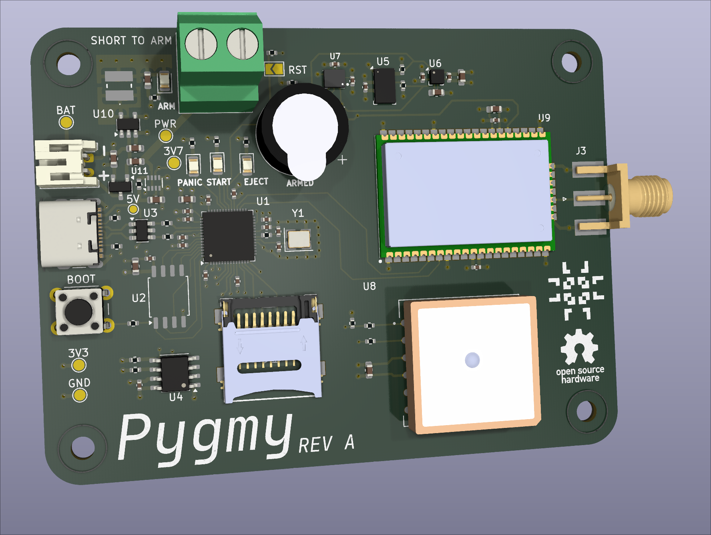

# Pygmy

This project is a rocket flight computer design for my TRA L1 certification flight. The name is a play on the fact that
it's designed to be small and also runs on a Pi (Py) chip. Yes, that means you can program it with MicroPython.

## Motivation

I am a computer systems engineer. I like electronics and computers. I like flying rockets and the challenges of embedded
flight computer systems. Therefore I would like to make a simple flight computer for my simple rocket, since that will
probably be the better engineered part of my L1 flight.

## Usage

To learn how to use the Pygmy, please check the manual under the `docs/` sub-directory. This manual contains both the
user guide for operation and a detailed developer guide.
