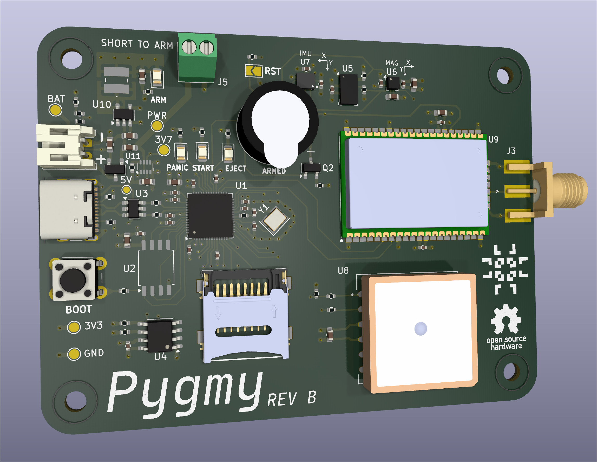

# Pygmy

This project is a rocket flight computer design for my TRA L1 certification flight. The name is a play on the fact that
it's designed to be small and also runs on a Pi (Py) chip. Yes, that means you can program it with MicroPython (Py).

The flight computer also has a sibling ground station receiver, the Pygmy GS.

## Motivation

I am a computer systems engineer who has designed avionics for my university's rocketry team for several years. I like
the challenge of designing, building and programming embedded systems for unique environments, like the inside of a
rocket. Although my L1 flight won't have the same challenges as my university's rockets (which fly up to 30k feet and
have hit Mach 1.89), it will still have challenges. It is, differently, entirely my own design to mess with and do as I
please!

My L1, as far as I'm concerned, is to be a relatively standard L1 rocket build (not a kit, still my own) outside of this
flight computer. That way I can get my cert while having a rocket which meets my primary goal: being a vessel for my
flight computer.

## Usage

To learn how to use the Pygmy, please check the manual under the `docs/` sub-directory. This manual contains both the
user guide for operation and a detailed developer guide.

Both guides are currently under construction.
