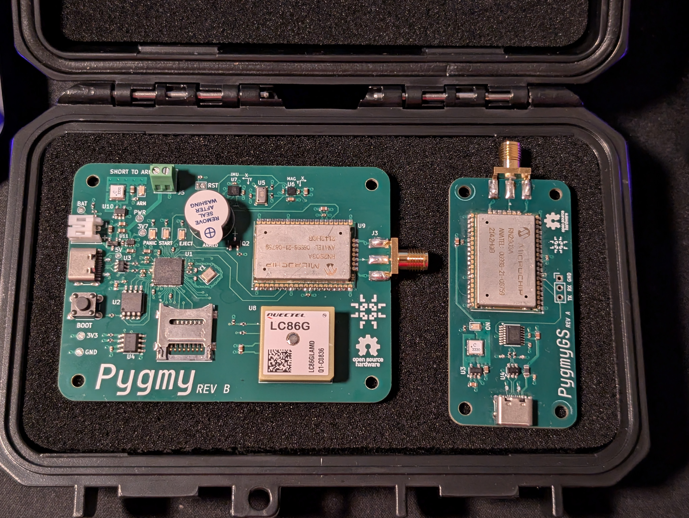
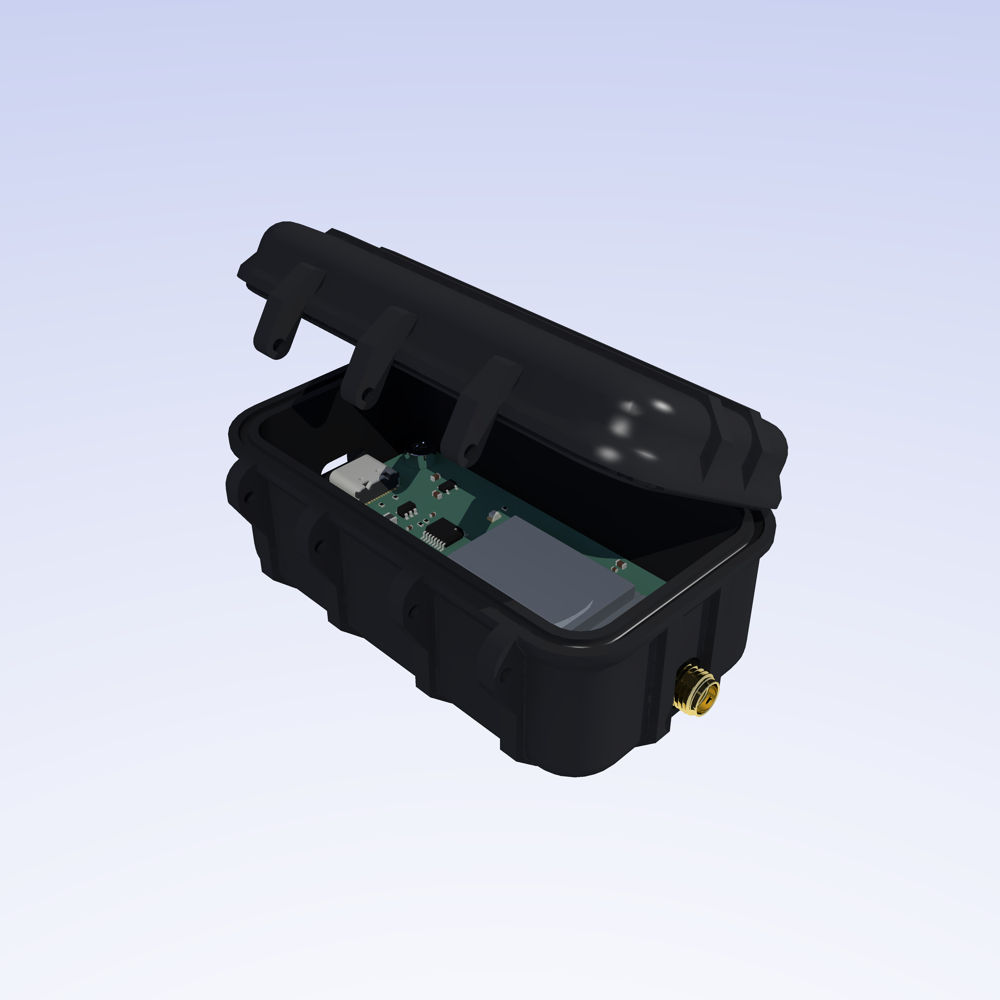

# Pygmy

This project is a rocket flight computer design for my TRA L1 certification flight. The name is a play on the fact that
it's designed to be small and also runs on a Pi (Py) chip. Yes, that means you can program it with MicroPython (Py).

The Pygmy was designed with the [Apache NuttX RTOS][nuttx] in mind (you can find the board support for it
[here][pygmy-nx]), but it is also possible to program it using the Pico C SDK or MicroPython (or really, whatever else
you can flash on an RP2040).

    
     
    Pygmy Rev B

    
     
    The prototype board Pygmy Rev B with its ground station sibling, PygmyGS.

The flight computer also has a sibling ground station receiver, the PygmyGS. This board allows you to receive telemetry
from the ground and can interface with consumer hardware like a laptop through its USB-C serial interface.

    
     
    The manufactured PygmyGS Rev A

    
     
    Handheld for scale

    
     
    The ECAD render of the PygmyGS Rev A

Here is the Pygmy within my L1 rocket:

## Motivation

I am a computer systems engineer who has designed avionics for my university's rocketry team for several years. I like
the challenge of designing, building and programming embedded systems for unique environments, like the inside of a
rocket. Although my L1 flight won't have the same challenges as my university's rockets (which fly up to 30k feet and
have hit Mach 1.89), it will still have challenges unique to rocketry like high vibration and lots of different forces,
arming requirements and logging speed requirements. Most differently, this flight computer is entirely my own project to
experiment with as I please!

My L1, as far as I'm concerned, is to be a relatively standard L1 rocket build (not a kit, still my own) outside of this
flight computer. That way I can get my cert while having a rocket which meets my primary goal: being a vessel for my
flight computer.

This flight computer, once flight tested in an L1, should in theory be capable up to L3 flights as a data logger.
Deployment control may be added in later revisions as I attempt my L2 certification with electronics, but that will be
much later.

## Usage

To learn how to use the Pygmy, please check the manual under the `docs/` sub-directory. This manual contains both the
user guide for operation and a detailed developer guide.

Both guides are currently under construction.

## Other Goodies

Along with the Pygmy and PygmyGS E-CAD design files _and_ free,
[open-source software][https://github.com/linguini1/pygmy-nx], there is additionally parametric CAD enclosure designs
included in this repository.

The PygmyGS case can be found under [`ground-station/enclosure`](./ground-station/enclosure), along with an assembly
file so you can see the PygmyGS mounted inside it with all the fasteners.

    
     
    PygmyGS hinged enclosure

A sample avionics bay for the Pygmy flight computer can be found under
[`flight-computer/enclosure`](./flight-computer/enclosure), along with an assembly file so you can see the Pygmy mounted
in the bay with a battery and arming switch. This design is also fully parametric so you can modify it to the body tube
diameter of your rocket, different battery size, etc. This design is largely based off of the configuration I flew in my
L1 certification flight, so feel free to fully change it depending on your constraints and desires! It is by no way the
recommended configuration for the Pygmy, just one possible design.

    
     
    Pygmy sample avionics bay

[pygmy-nx]: https://github.com/linguini1/pygmy-nx
[nuttx]: https://nuttx.apache.org/
